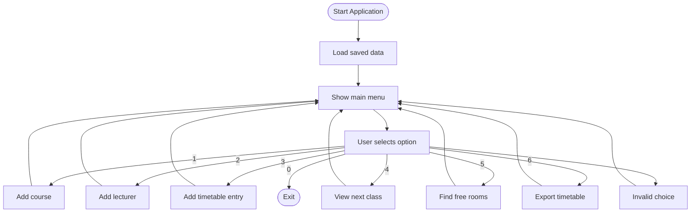
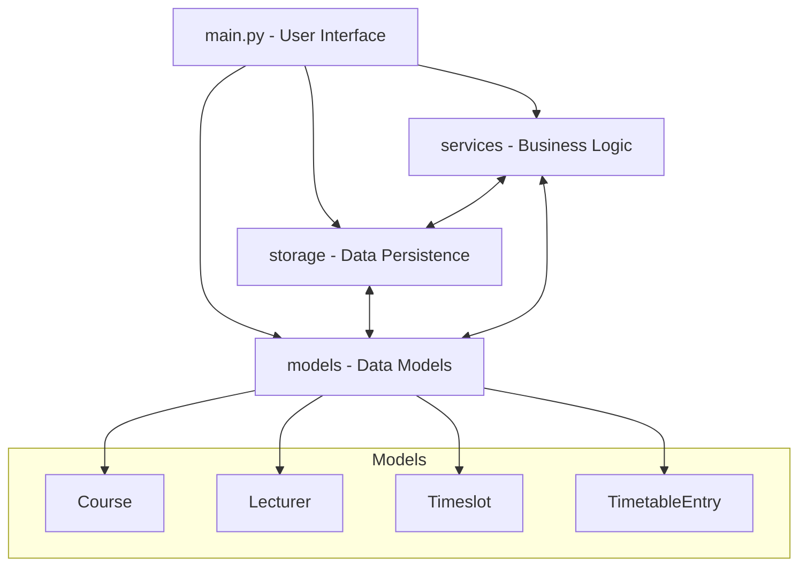

# Timetable Management System 🗓️

This documentation covers the **Timetable Management Application**, designed as a command-line tool for efficient class scheduling, clash detection, lecturer/course management, and timetable export. It merges all key guidance, project structure, and a deep-dive code walkthrough for the main application (`main.py`).

---

## Project Purpose and Overview

This application allows educational organizations or individuals to:

- **Register courses and lecturers**
- **Schedule classes** (with automatic clash detection)
- **Search for upcoming classes**
- **Find free rooms**
- **Export the timetable for sharing or printing**
- **Persist all data in a JSON file**
- **Test using Black-box, White-box, and Symbolic approaches**

No GUI or database is required; the system runs interactively in the terminal/command-line.

---

## File & Directory Structure

| File/Directory                | Purpose                                                                  |
|-------------------------------|--------------------------------------------------------------------------|
| `main.py`                     | Main application script and user menu interface                          |
| `models/`                     | Data models for courses, lecturers, timeslots, and timetable entries     |
| `services/`                   | Business logic for clash checking, searching, and exporting data         |
| `storage/`                    | Data persistence and storage logic (JSON serialization)                  |
| `data/store.json`             | Persistent storage file for all data                                     |
| `data/timetable_export.txt`   | Output file for exported timetable                                       |
| `tests/`                      | Test suites per group member and utilities                               |
| `pytest.ini`                  | Pytest configuration                                                     |
| `requirements.txt`            | Python dependencies                                                      |

---

## Main Features

- **Add new courses and lecturers**
- **Schedule classes with clash detection**
- **View the next upcoming class**
- **Find available/free rooms**
- **Export the timetable to a text file**
- **Persistent data storage in JSON**
- **Comprehensive test coverage**
- **Agile and CMMI-compliant project management**

---

## Main Application Flow

The core application logic revolves around a user-interactive, menu-driven loop, where all data is loaded at start and changes are saved after each operation.



---

## Application Architecture

The system is modular: separating concerns between models, storage, and services.



---

## Code Walkthrough: main.py

### Initialization and Data Persistence

On startup, the application:

1. **Instantiates core objects**:
   - `DataContext` (in-memory data)
   - `JsonStore` (for file storage)
   - `ModelFactory` (for deserialization)
2. **Loads previously saved data** from `data/store.json`.

All data changes (courses, lecturers, entries) are immediately saved to ensure persistence.

### Menu Operations

#### 1. Add Course

- Prompts for: Course ID, Name, Code, Level
- Adds the course to `DataContext.courses` and saves to JSON.

#### 2. Add Lecturer

- Prompts for: Lecturer ID, Name, Email
- Adds the lecturer to `DataContext.lecturers` and saves to JSON.

#### 3. Add Timetable Entry

- Prompts for: Course ID, Lecturer ID, Room, Day, Start/End time.
- **Validates for clashes** using `ClashService.validate_no_clashes`.
- On success, adds the entry and saves; on error, displays conflict messages.

```python
entry = TimetableEntry(
    course=ctx.courses[course_id],
    lecturer=ctx.lecturers[lecturer_id],
    room=room,
    timeslot=Timeslot(day, start, end)
)
errors = ClashService.validate_no_clashes(ctx.entries, entry)
if errors:
    for e in errors:
        print("ERROR:", e)
else:
    ctx.entries.append(entry)
    store.save(ctx)
    print("Timetable entry added.")
```

#### 4. View Next Class

- Prompts for: Current day, Current time
- Uses `SearchService.next_class` to find the next scheduled class.

#### 5. Find Free Rooms

- Prompts for: Day, Start, End time
- Uses `SearchService.find_free_rooms` to return a list of available rooms.

#### 6. Export Timetable

- Exports all timetable entries to `data/timetable_export.txt` using `ExportService.export_to_text`.

#### 0. Exit

- Exits the application loop safely.

---

## Data Models

| Model            | Fields                                                 |
|------------------|-------------------------------------------------------|
| `Course`         | `course_id`, `name`, `code`, `level`                  |
| `Lecturer`       | `lecturer_id`, `name`, `email`                        |
| `Timeslot`       | `day`, `start_time`, `end_time`                       |
| `TimetableEntry` | `course`, `lecturer`, `room`, `timeslot`              |

---

## Example User Flow

```text
=== Timetable Management System ===
1. Add course
2. Add lecturer
3. Add timetable entry
4. View next class
5. Find free rooms
6. Export timetable
0. Exit

Select option: 1
Course ID: CSCI101
Name: Introduction to Computer Science
Code: CS101
Level: 1
```

```text
Select option: 3
Course ID: CSCI101
Lecturer ID: L123
Room: Room 10
Day: Monday
Start time (HH:MM): 09:00
End time (HH:MM): 11:00
Timetable entry added.
```

---

## Example Data Store (`store.json`)

```json
{
  "courses": {
    "CSCI101": {
      "course_id": "CSCI101",
      "name": "Introduction to Computer Science",
      "code": "CS101",
      "level": 1
    }
  },
  "lecturers": {
    "L123": {
      "lecturer_id": "L123",
      "name": "Dr. Smith",
      "email": "smith@example.com"
    }
  },
  "entries": [
    {
      "course": "CSCI101",
      "lecturer": "L123",
      "room": "Room 10",
      "timeslot": {
        "day": "Monday",
        "start_time": "09:00",
        "end_time": "11:00"
      }
    }
  ]
}
```

---

## Example: Export Timetable

```python
ExportService.export_to_text(ctx.entries, "data/timetable_export.txt")
print("Timetable exported.")
```

---

## Best Practices & Recommendations

```card
{
    "title": "Best Practice",
    "content": "Always save changes after adding or modifying data to prevent loss on unexpected shutdown."
}
```

```card
{
    "title": "Data Consistency",
    "content": "Always ensure that course and lecturer IDs exist before adding timetable entries to avoid broken references."
}
```

```card
{
    "title": "Clash Prevention",
    "content": "Use the clash detection feature to keep schedules conflict-free and prevent double-bookings."
}
```

---

## Troubleshooting

- **Invalid Input**: The system prompts again for unrecognized menu options.
- **Missing Data**: Add courses/lecturers before scheduling classes with their IDs.

---

## Limitations

- ❗ **No authentication or user management**
- 🛠 **Minimal error handling**; invalid input may cause crashes.
- 📋 **CLI only**—no database or GUI, as required by project brief.
- 🚫 Not designed for production deployment.

---

## Extending and Customizing

- Add search/filter features (e.g. by lecturer, by level)
- Integrate a web or REST API
- Support recurring events or more complex constraints
- Role-based access (admin vs. viewer)

---

## Running & Testing the Application

### Prerequisites

- Python 3.10+ (tested up to Python 3.13)
- Pip
- Git

### Setup

```bash
python3 -m venv .venv
source .venv/bin/activate     # macOS/Linux
# .venv\Scripts\activate      # Windows

pip install -r requirements.txt
```

### Run the Main Application

```bash
python3 src/main.py
```

### Running Tests

- Each group member has their own test suite:
  - `pytest tests/259048805 -q`
  - `pytest tests/249058832 -q`
  - `pytest tests/259040710 -q`
  - `pytest tests/259047255 -q`
- For coverage:
  - `pytest --cov=src --cov-report=term-missing`
  - `pytest --cov=src --cov-report=html`

---

## Agile & Quality Assurance

- **Agile Scrum**: 4 sprints, GitHub Projects, equal story points, user stories, and issue tracking.
- **CMMI Level 2**: Documented requirements, planning, monitoring, configuration management, and measurement.
- **Testing**: Black-box, White-box, and Symbolic, with full coverage reports.

---

## Authors

| Student ID   |
|--------------|
| 259048805    |
| 249058832    |
| 259040710    |
| 259047255    |

---

## Declaration

This project complies with University of Leicester’s academic integrity policy. All development and testing followed the CO7095 module standards.

---

## License

Released for educational and demonstration purposes.

---

**Happy scheduling!**

---

### No API Endpoints

> **Note:** This system is console-based and does **not** expose any HTTP API endpoints at this time.

---

**End of documentation for `main.py`**
