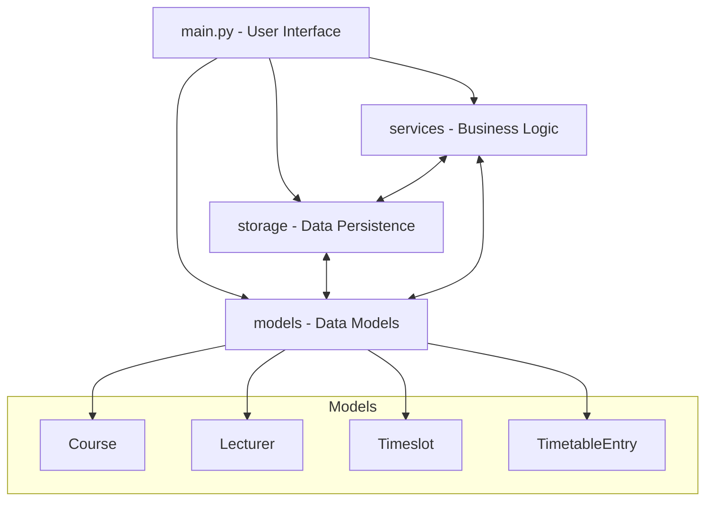
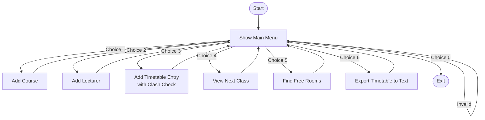

# Timetable Management System - Main Application

The `main.py` file serves as the **entry point** for a console-based Timetable Management System. It provides a user interface for managing courses, lecturers, and timetable entries. The application also supports viewing upcoming classes, finding free rooms, and exporting the timetable.

---

## Overview of the Main Components

The code integrates multiple modules, each handling a specific aspect of data management or business logic:

- **Data Storage**: Handles saving and loading of timetable data.
- **Model Factory**: Responsible for creating model instances from stored data.
- **Services**: Provide utility functions like clash detection, search, and export.
- **Models**: Define the structure for courses, lecturers, timeslots, and timetable entries.

---

## Main Features

- Add, view, and manage courses, lecturers, and timetable entries.
- Detect and prevent scheduling clashes.
- Find the next scheduled class.
- Search for free rooms within a timeslot.
- Export the current timetable to a text file.

---

## Core Application Flow

The main application flow centers around a looped menu-driven interface. Here’s how the logic is structured:


---

## Main Menu Operations

### 1. Add Course

Prompts the user for course details and adds a new course to the system.

- **Prompts for:** Course ID, Name, Code, Level
- **Stores:** In-memory and persistent storage

### 2. Add Lecturer

Adds a new lecturer to the system by collecting relevant information.

- **Prompts for:** Lecturer ID, Name, Email

### 3. Add Timetable Entry

Schedules a new class, linking a course, lecturer, room, and timeslot.

- **Checks for scheduling clashes** using `ClashService`.
- **Prompts for:** Course ID, Lecturer ID, Room, Day, Start/End time

### 4. View Next Class

Displays the next scheduled class based on the current day and time.

- **Prompts for:** Current day, Current time

### 5. Find Free Rooms

Finds and lists rooms not scheduled at a specified time.

- **Prompts for:** Day, Start and End time

### 6. Export Timetable

Exports the current timetable entries to a text file.

- **Saves to:** `data/timetable_export.txt`

### 0. Exit

Exits the application.

---

## Key Classes and Their Roles

| Class/Module              | Purpose                                              |
|---------------------------|-----------------------------------------------------|
| `DataContext`             | Holds in-memory data: courses, lecturers, entries   |
| `JsonStore`               | Loads and saves data from/to a JSON file            |
| `ModelFactory`            | Instantiates models from raw data                   |
| `ClashService`            | Detects timetable clashes                           |
| `SearchService`           | Finds next class and free rooms                     |
| `ExportService`           | Exports timetable data to text                      |
| `Course`, `Lecturer`, ... | Define main entities of the system                  |

---

## Example: Adding a Timetable Entry

```python
entry = TimetableEntry(
    course=ctx.courses[course_id],
    lecturer=ctx.lecturers[lecturer_id],
    room=room,
    timeslot=Timeslot(day, start, end)
)
errors = ClashService.validate_no_clashes(ctx.entries, entry)
if errors:
    for e in errors:
        print("ERROR:", e)
else:
    ctx.entries.append(entry)
    store.save(ctx)
    print("Timetable entry added.")
```

- **ClashService** ensures no overlapping classes for room, lecturer, or course.

---

## Application Control Loop

The application uses an infinite loop to display the menu and process user input until exit:

```python
while True:
    main_menu()
    choice = input("Select option: ").strip()
    # ... handle choices ...
    if choice == "0":
        break
```

---

## Persistent Data Storage

The application uses a JSON file (`data/store.json`) to persist all data. On start, it loads existing data; after any modification, it saves changes.

---

## Example: Export Timetable

```python
ExportService.export_to_text(ctx.entries, "data/timetable_export.txt")
print("Timetable exported.")
```

- **Exports** all current timetable entries in a human-readable format.

---

## Limitations & Recommendations

- ❗ **No authentication or user management**—the system is open to any user running the script.
- 🛠 **Error handling** is minimal; invalid input may cause crashes.
- ✨ **Enhancements**: Add validation, better input prompts, and support for deleting/editing entries.

---

```card
{
    "title": "Best Practice",
    "content": "Always save changes after adding or modifying data to prevent loss on unexpected shutdown."
}
```

---

## Summary

The `main.py` file orchestrates a simple yet robust command-line timetable management solution. It leverages modular design, persistent storage, and service-oriented architecture for maintainability. The menu-driven interface makes it accessible for basic use cases in academic scheduling.

---

### No API Endpoints

**Note:** This file does not define HTTP API endpoints or routes. All interactions are via the command-line interface. No API documentation blocks are needed.

---

**End of documentation for `main.py`**
# Timetable Management System 🗓️

This project is a **command-line-based Timetable Management System** for managing courses, lecturers, and timetable entries. It includes key features such as clash detection, class search, free room finding, and schedule export. The application persists data using a JSON file and provides a user-friendly interactive menu.

---

## Purpose and Overview

The system helps educational institutions or individual users to:
- Register courses and lecturers
- Schedule classes with clash validation
- Quickly search for next classes
- Find free rooms given timeslots
- Export the timetable for further use

---

## File Structure

| File/Directory      | Purpose                                                                |
|---------------------|-----------------------------------------------------------------------|
| `main.py`           | Main application script and user menu interface                       |
| `storage/`          | Data persistence and storage logic                                    |
| `services/`         | Business logic for clash checking, searching, and exporting data      |
| `models/`           | Data models for courses, lecturers, timeslots, and timetable entries  |
| `data/store.json`   | Persistent storage file for all data                                  |
| `data/timetable_export.txt` | Output file for exported timetable                          |

---

## Key Features

- **Add new courses and lecturers**
- **Schedule classes with automatic clash detection**
- **View the next upcoming class**
- **Find available/free rooms for a given timeslot**
- **Export the timetable to a text file**
- **Persistent data storage in JSON**

---

## Application Architecture

The system separates concerns into data models, storage, and business logic. Below is a high-level view of the architecture:



---

## Main Menu and User Flow

Upon running the program, users are presented with a simple menu:

```
=== Timetable Management System ===
1. Add course
2. Add lecturer
3. Add timetable entry
4. View next class
5. Find free rooms
6. Export timetable
0. Exit
```

Actions are performed interactively, with data automatically saved after each operation.

---

## Detailed Code Walkthrough

### Data Loading and Saving

- The program uses `JsonStore` to **load** all stored data (courses, lecturers, timetable entries) on startup, and **save** changes after every add/modify operation.

### Adding Courses and Lecturers

- Users provide details for each new course or lecturer.
- The system stores these in the `DataContext` and persists them to `store.json`.

### Scheduling Entries with Clash Detection

- When scheduling a class, the system:
  - Collects details (course, lecturer, room, day, start/end time)
  - Constructs a `TimetableEntry` object
  - Invokes `ClashService.validate_no_clashes` to ensure there are **no time or room conflicts**
  - If validation passes, the entry is saved; otherwise, errors are shown.

### Finding Next Class and Free Rooms

- The system can search for the next scheduled class after a given day/time using `SearchService.next_class`.
- It can also find all **free rooms** for a specified timeslot using `SearchService.find_free_rooms`.

### Exporting the Timetable

- All timetable entries can be exported to a readable text file using `ExportService.export_to_text`, for sharing or printing.

---

## Detailed Main Menu Flow



---

## Example Usage

### Adding a Course

```
Select option: 1
Course ID: CSCI101
Name: Introduction to Computer Science
Code: CS101
Level: 1
```

### Adding a Timetable Entry (with clash check)

```
Select option: 3
Course ID: CSCI101
Lecturer ID: L123
Room: Room 10
Day: Monday
Start time (HH:MM): 09:00
End time (HH:MM): 11:00
Timetable entry added.
```

### Viewing Next Class

```
Select option: 4
Current day: Monday
Current time (HH:MM): 08:30
Next class: CS101 Monday 09:00
```

### Finding Free Rooms

```
Select option: 5
Day: Monday
Start time (HH:MM): 09:00
End time (HH:MM): 10:00
Free rooms: ['Room 3', 'Room 6', 'Room 7']
```

### Exporting Timetable

```
Select option: 6
Timetable exported.
```

---

## Data Models Overview

| Model           | Fields                                                    |
|-----------------|----------------------------------------------------------|
| `Course`        | `course_id`, `name`, `code`, `level`                     |
| `Lecturer`      | `lecturer_id`, `name`, `email`                           |
| `Timeslot`      | `day`, `start_time`, `end_time`                          |
| `TimetableEntry`| `course`, `lecturer`, `room`, `timeslot`                 |

---

## Example Data Store (`store.json`)

```json
{
  "courses": {
    "CSCI101": {
      "course_id": "CSCI101",
      "name": "Introduction to Computer Science",
      "code": "CS101",
      "level": 1
    }
  },
  "lecturers": {
    "L123": {
      "lecturer_id": "L123",
      "name": "Dr. Smith",
      "email": "smith@example.com"
    }
  },
  "entries": [
    {
      "course": "CSCI101",
      "lecturer": "L123",
      "room": "Room 10",
      "timeslot": {
        "day": "Monday",
        "start_time": "09:00",
        "end_time": "11:00"
      }
    }
  ]
}
```

---

## API Endpoints

> **Note:** This system is currently a **console application** and does not expose HTTP API endpoints. All interactions take place via the command-line interface.

---

## Running the Application

1. Ensure you have Python 3.x installed.
2. Required modules should be present in the project directory.
3. To start:

```bash
python main.py
```

---

## Best Practices & Recommendations

```card
{
    "title": "Data Consistency",
    "content": "Always ensure that course and lecturer IDs exist before adding timetable entries to avoid broken references."
}
```

```card
{
    "title": "Clash Prevention",
    "content": "Use the clash detection feature to keep schedules conflict-free and prevent double-bookings."
}
```

---

## Extending and Customizing

- **Add more search/filter features** (e.g., by lecturer, by level)
- **Integrate with a web or REST API** for remote access
- **Support for recurring events or more advanced constraints**
- **Role-based access (admin vs. viewer)**

---

## Troubleshooting

- **Invalid Input**: If you enter an invalid menu option, the system will prompt again.
- **Missing Data**: If you try to schedule an entry with a non-existent course or lecturer, add them first.

---

## License

This project is released for educational and demonstration purposes.

---

## Credits

Developed as a modular, extensible timetable management solution for programming and software engineering exercises.

---

**Happy scheduling!**
